# Learning Databricks and GitHub Actions

Welcome to this workshop for learning Databricks and GitHub Actions!

For this workshop, your task is to complete a Databricks workbook for cleaning and analyzing data from Airbnb. In addition, you will be setting up workflows for testing and labeling pull requests for the source code.  
 

## Pre requisites

1. A personal GitHub account. 
If you don't have one, [a GitHub account can be created for free](https://github.com/signup?ref_cta=Sign+up&ref_loc=header+logged+out&ref_page=%2F&source=header-home).

2. [Git](https://git-scm.com/downloads) 

3. A code editor. We recommend [Visual Studio Code](https://code.visualstudio.com/).

4. An [Azure student account](https://azure.microsoft.com/nb-no/free/students/)


## Setup

You will be working with: 

- Azure Portal (accessible through browser)
- Databricks (accessible through browser)
- GitHub (accessible through browser)
- Code editor 

Look for the icon to identify which tools to use for which task. 

## Task 1 - Set up Databricks workspace
 
1. Log onto the [Azure Portal](https://portal.azure.com/)

2. In the search field, type _Databricks_

3. Select `Azure Databricks` under _Services_

    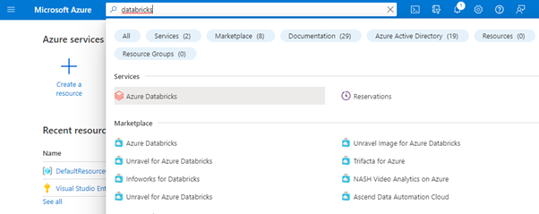

4. You are now redirected to the Databricks service. Click `Create`
    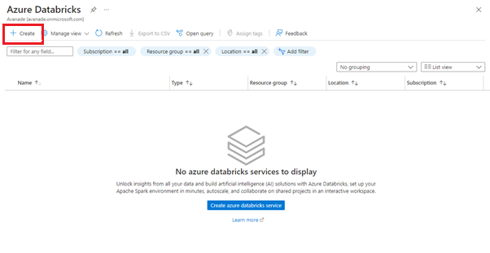

5. Configure the service
    - _Subscription_: leave default opiton
    - _Resource group_: Create a new one, and name it `ava-kurs-rg`
    - _Workspace name_: `ava-kurs-ws`
    - _Region_: `North Europe`
    - _Pricing Tier_: `Standard`

 6. Click _Review and Create_

    

7. If validation is successful, click `Create`.

This takes a couple of minutes. 

Let's move on to the next task, and get back to this once it's ready.


## Task 2 - Fork the repository to your own GitHub account

We will be working with a repository that contains two Databricks workbooks and unit tests both for the notebooks and dataset. 

In GitHub, fork [the repository](https://github.com/acn-sbuad/ava-kurs-databricks) to your personal GitHub account.

Create a new branch __data-cleaning__ which derives from the __main__ branch. Let's get started! 


## Task 3 - Generate a personal access token for GitHub

1. In GitHub, navigate to your __Git account settings__, then __Developer Settings__. Click the `Personal access tokens` menu, then click `Generate new token`.

    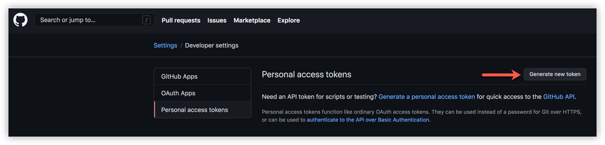

2. Write _Databricks_ in __Note__, and select `repo` as the scope. The token will be applicable for all the specified actions in your repositories.

    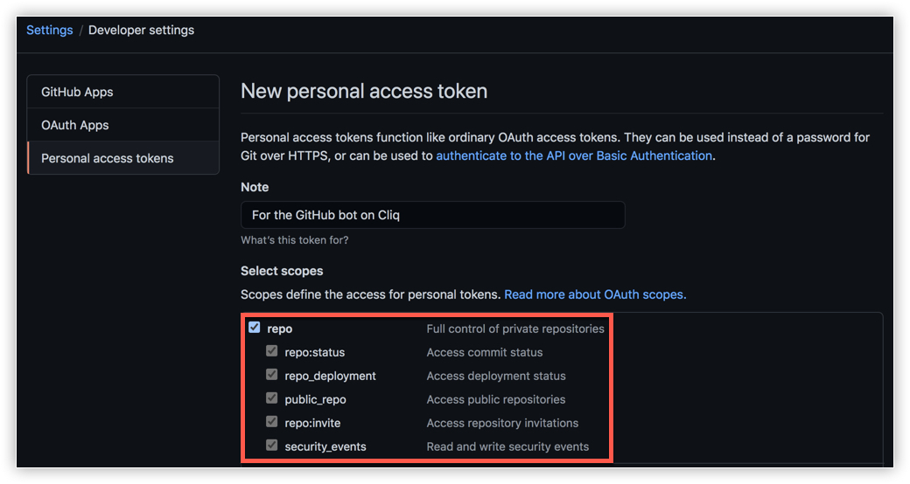

3. Click `Generate Token`.

    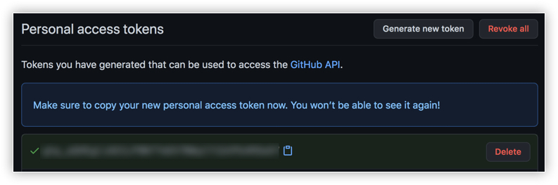

4. Copy the token value to _Notepad_ or a similar text editor for safe keeping. We will be using it in later steps.


## Task 4 - Connect Databricks to GitHub repository

1. Navigate back to the [Databricks page in the Azure Portal](https://portal.azure.com/#blade/HubsExtension/BrowseResource/resourceType/Microsoft.Databricks%2Fworkspaces)
 
2. Select the workspace you just created from the list
 
3. If the workspace is fully provisioned, you should see the page below. Click `Launch workspace`
    

4. You are now redirected to Databricks and presented with the menu
    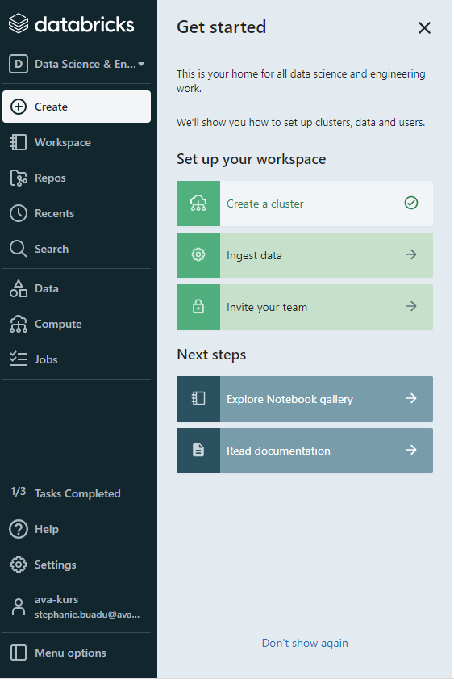

5. Select __Settings__ , click __User Settings__ and navigate to the __Git integrations__ tab.

6. Configure the personal access token
    - __Git Provider__: GitHub
    - __Git provider username or email__: Add your GitHub username
    - __Token__ Copy the personal access token you generated in GitHub.

    Click `Save`

7. Back in the menu select __Repos__ in the menu and click __Add repo__

8. Set up the connection for your forked repository.

    Add the url for the repository and select GitHub as source. 

    Click `Create`

    

    You should see the files from the GitHub repository when you drill into the __Repos__ section.

    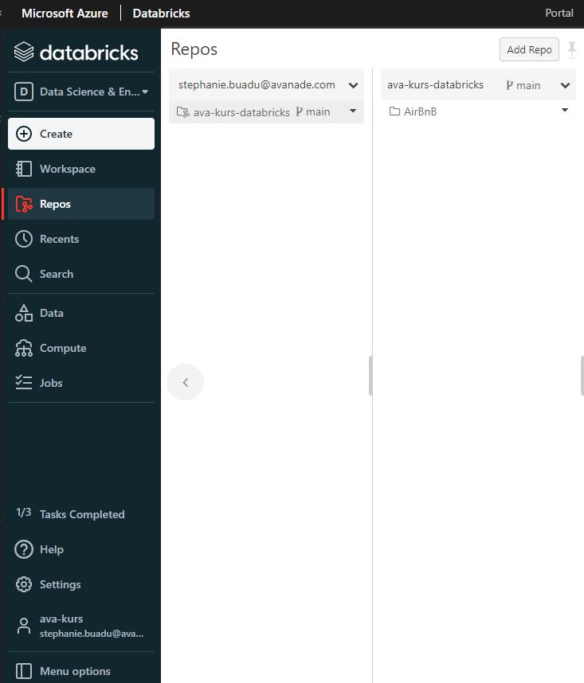
   

## Task 5 - Create a cluster

To run operations in Databricks you must have a cluster in place. 
In this task, we will be setting up the cluster.

1. In the menu in Databricks, select __Create__ and __Cluster__

2. Set up the following configuration
    - _Cluster name_: `ava-kurs-cluster`
    - _Cluster mode_: `Single Node`
    - _Databricks runtime version_: `Runtime: 10.4 LTS`
    - _Worker type_: Compute optimized, `Standard_F4`
    
3. Open __Advanced Options__ at the bottom of the page. In the section ___Environment variables___ add _GITHUB_TOKEN_=`your github token` that you saved in a notepad
    
    Leave the rest of the settings to the default value.

4. Click `Create cluster`

## Task 6 - Upload dataset to Databricks

Databricks allows for data from various sources such as Azure Storage and [insert another storage source], but for simplicity, we will be manually uploading the data to the clusters file storage. 

1. Download the [Airbnb data set](listings.csv) and save it in a reasonable location. When the raw file is opened in a new browser window just right-click the page and click on `Save as`.

2. In the menu select `Data` and then click `Create table`.

3. Drop the file into the section _Drop files to upload, or click to browse_

## Task 7 - Set up workflow for running unit tests

1. Go to the __Actions__ tab in your Github portal repo

2. Search for _python_ worfklow patterns. As you can see there is plenty of different patterns you can choose from. In this scenario we're gonna go for a __Python application__. Click on the `Configure` button
 
 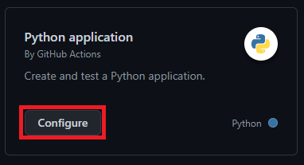

3. Study the workflow file. Can you identify the key components?
    - Which events does the workflow listen after?
    - The runner defined, is it a self-hosted agent or a GitHub runner?
    - Could you think of another runner that could have been used? [Available runners](https://docs.github.com/en/actions/using-github-hosted-runners/about-github-hosted-runners)

4. Let's do some changes in our file. Let's start with changing the name to _PyTest_. This workflow is running unit tests that are stored in __Test/data-cleansing__ folder. 

5. Then we will remove lines from 31 to 36. This is a linting action. We won't need it today.

6. Attribute __on__ determines which events will trigger the workflow. As a defualt it's _push_ and _pull-request_ actions on the _main_ branch.
   Please remove line 7 and 8 as we won't trigger our workflow on _push_ to the _main_ branch. Instead we will focus on _pull-request_.

7. We can also run the workflows manually. Let's try this! Add `workflow_dispatch:` to your code above the _pull_request_ attribute
```yml
on:
  workflow_dispatch:
  pull_request:
    branches: [ main ]
```

8. Your file should look like this 
```yml
name: PyTest

on:
  workflow_dispatch:
  pull_request:
    branches: [ main ]

permissions:
  contents: read

jobs:
  build:

    runs-on: ubuntu-latest

    steps:
    - uses: actions/checkout@v3
    - name: Set up Python 3.10
      uses: actions/setup-python@v3
      with:
        python-version: "3.10"
    - name: Install dependencies
      run: |
        python -m pip install --upgrade pip
        pip install flake8 pytest
        if [ -f requirements.txt ]; then pip install -r requirements.txt; fi
    - name: Test with pytest
      run: |
        pytest
```

9. Commit your changes. Click on `Start commit`

10. Click on the `Actions` tab again. 

11. Under workflows click on `PyTest` and `Run workflow`. How was the result? 

Well as you can see it wasn't successful as all the unit tests failed. It's because the __airbnb_clean.csv__ file is empty. We will fill it up with data later in this course. For now let's leave it like that.

## Task 8 - Automating developer workflows

A great benefit to GitHub Actions is that it does not only support 
automation of CI/CD workflows. Workflows in GitHub allow us to automate
time consuming and error prone developer workflows, such as

- issue and pull request labeling
- assignment of issues and/or pull request to developers
- creation of release notes
- patching of dependencies

In this task you will explore one of the developer workflows that can be automated; __setting up workflow for labeling PRs based on which part of code is modified.__

In projects with large code bases labels are often used for both issues and pull requests to identify which part of the solution they relate to. 

Below is an example of some issues from [Azure's repository azure-sdk-for-net](https://github.com/Azure/azure-sdk-for-net/issues). Notice the different labels assigned to each issue.

  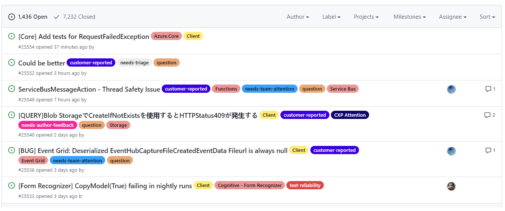


We will be setting up a workflow to automatically label pull requests based on the files that the PR modifies using an action from the GitHub Marketplace.


### Step 1 - Define the labels for the workflow to use

A prerequisite for the action we are using is a file that defines the labels and the files in the repository that each label applies to.
Make sure you are still on the __main__ branch.
Create an empty file called `labeler.yml` in the `.github` folder
and copy the content below.

```yml
area/test:
  - 'Test/**/*'
  - 'Test/**/**/*'

area/automation:
  - '.github/**/*'

area/development:
  - 'AirBnB/**/*'
```

The file defines three labels for the repository. Below you find a description of 
each label.

|Label            |Description                  |
|-----------------|-----------------------------|
|area/test        | Covers all changes under the `Test` directory |
|area/automation  | Covers all changes under the `.github` directory  |
|area/development | Covers all changes under the `AirBnB` directory  |
--------

**Can you think of any other labels to add to the repository?**

### Step 2 - Set up a workflow for automatic labeling on PR

In the `.github/workflows` folder create a new file and name it `pr-labeler.yml`.
Copy the code below into the file.

```
name: Pull Request Labeler
on: [pull_request_target]

jobs:
  label:

    runs-on: ubuntu-latest

    steps:
    - name: Labeler
      uses: [insert correct action]
      with:
        repo-token: ${{ "{{ secrets.GITHUB_TOKEN " }}}}
```

This defines an action that triggers on the event of a pull requests. 
The key word `pull_request_target` differs from `pull_request` in that
the workflow will run in the context of the base of the pull request, rather than the merge commit. 

A single job `label` running on an `ubuntu-latest` runner defines a single step `Labeler` using a not yet defined action. The action is given access to a secret from the repository.


### Step 3 - Complete the workflow file

The workflow copied in step 2 is not valid. The action to use is missing.

Find the correct action to insert from [Github Marketplace for Actions](https://github.com/marketplace?type=actions).

>🎈 Hint: The action is published by `actions` and we are working on adding a `Label` to a pull request.

### Step 4 - Commit and push your workflow to the repository


### Step 5 - Create a PR to test the new workflow

Now let's switch to `data-cleaning` branch.

Navigate to `Test/data-cleansing/airbnb_test.py`.

Enable editing of the file by clicking the pencil icon

  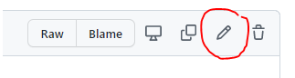

Add a line break to one of the lines in the file e.g. after a comment. 

Make sure to give the change a descriptive name. Click on __Commit changes__

  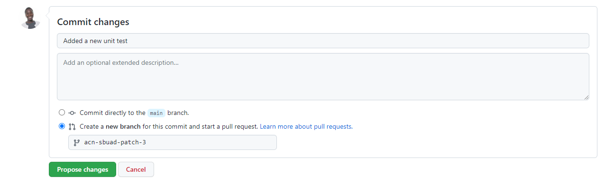

Once the PR is create, follow the workflow run from the `Actions` tab in GitHub, and confirm that the PR is successfully labeled (Check the Pull Request Labeler workflow as the PyTest workflow will fail).

  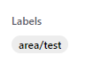

## Task 9 - Clean dataset 
Let's stark with adding pygithub library to run github api directly from the notebooks 

1. In the Databricks workspace find and click `Compute` link.
 
 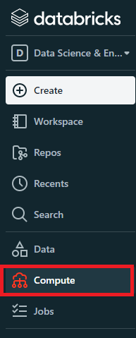

2. Click on the name of your cluster and then find `Libraries` tab. Click on it. 

3. Click `Install new` and when the window appears, choose PyPi and write _pygithub_ in the __Package__ field.

4. Click `Install` and we are all set up.  
 
 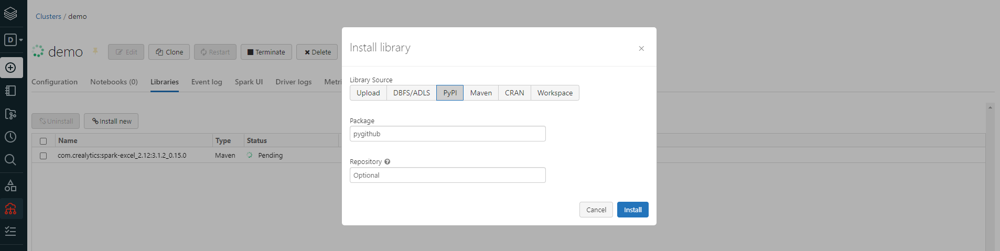  

We have our Airbnb data available, and we have our unit tests set up in a workflow. Let's get to cleaning the data to make it easier to work with and analyze. 

You will find the task description integrated in the workbook.

In Databricks, navigate to _Repos_, select the _AirBnB_ folder, 
select the _data-cleansing_ folder and finally the `Data Cleansing Lab` workbook. 

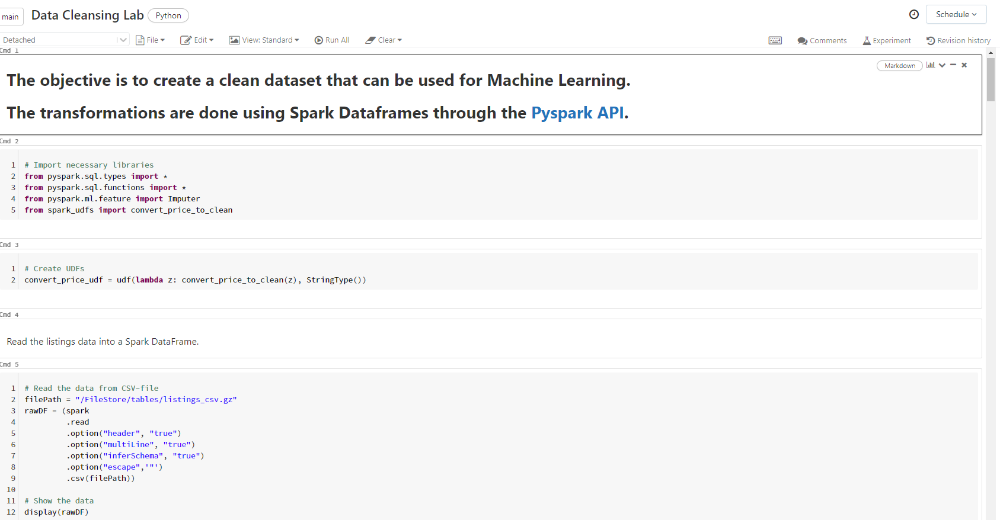

Simply follow the instructions in the workbook, and check back in for the next task once you've reached the end. 

Good luck! 

## Task 10 - Create PR with the changes to the workbook

Once you're happy with the modifications you've made to the workbook. It's time to commit the changes to the Git repository.
We will do this through a pull request (PR) so that all our created workflows will be triggered. 

In Databricks, click 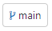 in the top menu. 

A dialogue window highlighting all your changes should appear. 
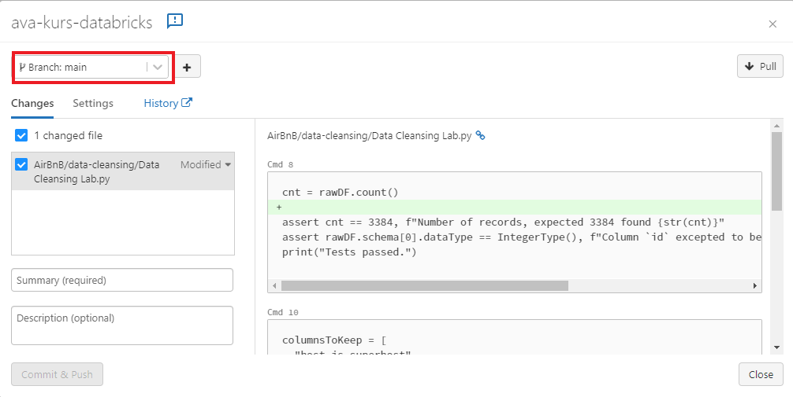

In order to create a PR we must commit the changes to the `data-cleaning` branch. Let's switch to it. 

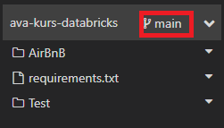

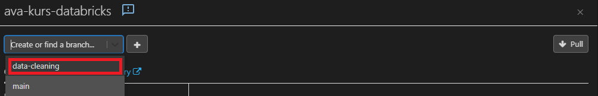


Add a summary of the changes and click `Commit & Push`

Follow the link in the dialogue to complete the pull request in GitHub.

Are your workflows being triggered and yielding the expected results? If not, what changes can you make to the workflow to make it work? 


## Task 11 - Linear regression on data

The data is now cleaned and we can finally start analyzing it.

In Databricks, navigate to _Repos_, select the _AirBnB_ folder, 
select the _linear-regression_ folder and finally the `Linear Regression Lab` workbook. 

Just as before, you follow the instructions in the workbook, and check back in once you've reached the end.
