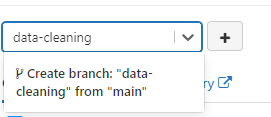
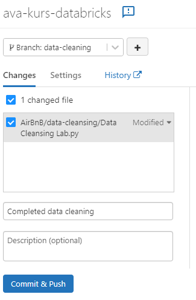

# Learning Databricks and GitHub Actions

Welcome to this workshop for learning Databricks and GitHub Actions!

For this workshop, your task is to complete a Databricks workbook for cleaning and analyzing data from Airbnb. In addition, you will be setting up workflows for testing and labeling pull requests for the source code.  

## Pre requisites

1. A personal GitHub account. 
If you don't have one, [a GitHub account can be created for free](https://github.com/signup?ref_cta=Sign+up&ref_loc=header+logged+out&ref_page=%2F&source=header-home).

2. A code editor. We recommend [Visual Studio Code](https://code.visualstudio.com/).

3. An [Azure student account](https://azure.microsoft.com/nb-no/free/students/)

## Task 1 - Set up Databricks workspace
 
1. Log onto the [Azure Portal](https://portal.azure.com/)

2. In the search field, type _Databricks_

3. Select `Azure Databricks` under _Services_

    

4. You are now redirected to the Databricks service. Click `Create`
    

5. Configure the service
    - _Subscription_: leave default opiton
    - _Resource group_: Create a new one, and name it `ava-kurs-rg`
    - _Workspace name_: `ava-kurs-ws`
    - _Region_: `North Europe`
    - _Pricing Tier_: `Standard`

 6. Click _Review and Create_

    

7. If validation is successful, click `Create`.

This takes a couple of minutes. 
Let's move on to the next task, and get back to this once it's ready.

## Task 2 - Fork the repository to your own GitHub account

We will be working with a repository that contains two workbooks and unit tests both for the notebooks and dataset. 

Fork [the repository](https://github.com/acn-sbuad/ava-kurs-databricks) to your personal GitHub account, and let's get started! 

## Task 3 - Generate a personal access token for GitHub

1. Navigate to your __Git account settings__, then __Developer Settings__. Click the __Personal access tokens__ menu, then click __Generate new token__.

    

2. Add `Databrocks` in Note, and select __repo__ as the scope. The token will be applicable for all the specified actions in your repositories.

    

3. Click Generate Token.

    

4. Copy the token value to _Notepad_ or a similar text editor for safe keeping. We will be using it in a later step.

## Task 4 - Connect Databricks to GitHub repository

1. Navigate back to the [Databricks page in the Azure Portal](https://portal.azure.com/#blade/HubsExtension/BrowseResource/resourceType/Microsoft.Databricks%2Fworkspaces)
 
2. Select the workspace you just created from the list
 
3. If the workspace is fully provisioned, you should see the page below. Click `Launch workspace`
    

4. You are now redirected to Databricks and presented with the menu
    

5. Select __Settings__ , click __User Settings__ and navigate to the __Git integrations__ tab.

6. Configure the personal access token
    - __Git Provider__: GitHub
    - __Git provider username or email__: Add your GitHub username
    - __Token__ Copy the personal access token you generated in GitHub.

    Click `Save`

7. Back in the menu select __Repos__ in the menu and click __Add repo__

8. Set up the connection for your forked repository.

    Add the url for the repository and select GitHub as source. 

    Click __Create__

    

    You should see the files from the GitHub repository when you drill into the __Repos__ section.

    

## Task 5 - Create a cluster

To run operations in Databricks you must have a cluster in place. 
In this task, we will be setting up the cluster.

1. In the menu in Databricks, select __Create__ and __Cluster__
2. Set up the following configuration
    - _Cluster name_: `ava-kurs-cluster`
    - _Cluster mode_: `Single Node`
    - _Databricks runtime version_: `Runtime: 10.4 LTS`
    - _Worker type_: Compute optimized, `Standard_F4`
    
3. Open __Advanced Options___ at the bottom of the page. In the section ___Environment variables___ add GITHUB_TOKEN=your github token that you saved in a notepad
    
    Leave the rest of the settings to the default value.
4. Click Create cluster

## Task 5 - Upload dataset to Databricks

Databricks allows for data from various sources such as Azure Storage and [insert another storage source], but for simplicity, we will be manually uploading the data to the clusters file storage. 

1. Download the [Airbnb data set](listings.csv) and save it in a reasonable location
2. In the menu select __Data__ in the menu and click __Create table__.
3. Drop the file into the section _Drop files to upload, or click to browse_

## Task 6 - Set up workflow for running unit tests

[TODO]
Should give student an overview of what is failing and status quo. 
Helpertests running ok, all tests related to dataset cleaning should be failing

## Task 7 - Set up workflow for labeling PRs based on part of code

[TODO]

## Task 8 - Clean dataset 

We have our Airbnb data available, and we have our unit tests set up in a workflow. Let's get to cleaning the data to make it easier to work with and analyze. 

You will find the task description integrated in the workbook.

In Databricks, navigate to _Repos_, select the _Airbnb_ folder, 
select the _data-cleansing_ folder and finally the `Data Cleansing Lab` workbook. 

Simply follow the instructions in the workbook, and check back in for the next task once you've reached the end. 

Good luck! 

## Task 9 - Create PR with the changes to the workbook

Once you're happy with the modifications you've made to the workbook. It's time to commit the changes to the Git repository.
We will do this through a pull request (PR) so that all our created workflows will be triggered. 

In Databricks, click  in the top menu. 

A dialogue window highlighting all your changes should appear. 

In order to create a PR we must commit the changes to a different branch. 

In the box marked with red, type the name of your branch, and click `Create Branch:`.

Add a summary of the changes and click _Commit & Push_

Follow the link in the dialogue to complete the pull request in GitHub.

Are your workflows being triggered and yielding the expected results? If not, what changes can you make to the workflow to make it work? 

## Task 10 - Linear regression on data

The data is now cleaned and we can finally start analyzing it.

In Databricks, navigate to _Repos_, select the _Airbnb_ folder, 
select the _linear-regression_ folder and finally the `Linear Regression Lab` workbook. 

Just as before, you follow the instructions in the workbook, and check back in once you've reached the end.
